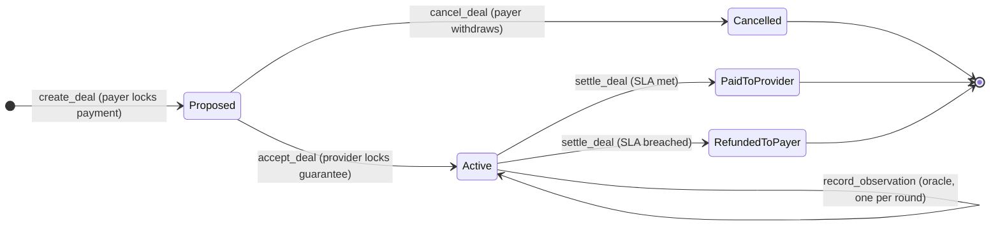
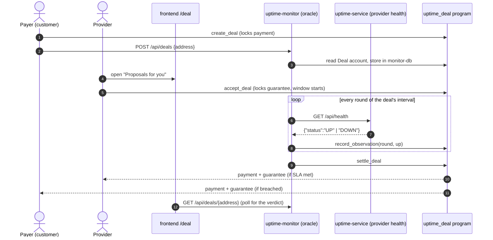
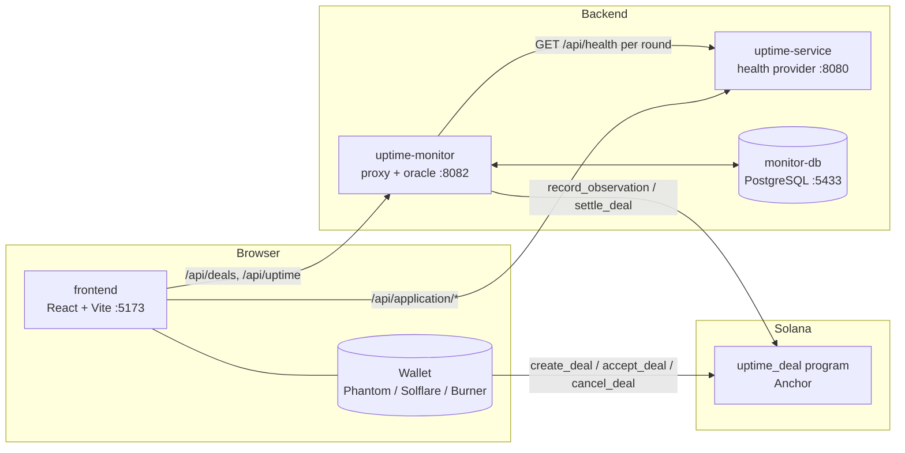

<div align="center">

# SLAna

**Uptime agreements that settle themselves on Solana.**

A customer pays for a service, the provider backs its uptime promise with a guarantee, an oracle reports whether the service was up in each round, and a Solana program decides who gets paid. Nobody has to trust the other side's numbers.


[How it works](#-how-it-works) · [Quick start](#-quick-start) · [Modules](#-modules) · [API](#-api-reference) · [Testing](#-testing) · [Roadmap](#-roadmap)

</div>

---

## Table of contents

- [Why SLAna](#-why-slana)
- [How it works](#-how-it-works)
  - [Deal lifecycle](#deal-lifecycle)
  - [Who does what](#who-does-what)
  - [The settlement rule](#the-settlement-rule)
- [Architecture](#-architecture)
- [Modules](#-modules)
- [Quick start](#-quick-start)
- [Configuration](#-configuration)
- [API reference](#-api-reference)
- [Testing](#-testing)
- [Project structure](#-project-structure)
- [Roadmap](#-roadmap)
- [Further documentation](#-further-documentation)
- [Contributing](#-contributing)

---

## 💡 Why SLAna

A traditional SLA is a promise in a PDF. When the provider misses it, the customer has to collect evidence, file a claim, and wait for a credit that the provider calculates.

SLAna turns the SLA into a deal on chain:

| | Traditional SLA | SLAna |
|---|---|---|
| **Money** | Credit issued later, if the provider agrees | Both sides lock SOL in escrow up front |
| **Evidence** | Provider's own dashboards | Per-round UP/DOWN observations recorded on chain |
| **Verdict** | Decided by the provider | Decided by the program from its own counters |
| **Payout** | Weeks, manual | One transaction, which anyone can send |
| **Provider walks away?** | Customer chases them | The payer can withdraw the proposal before it is accepted |

> **Monitors observe; the program decides.** The oracle only reports whether each round was UP or DOWN. The threshold check and the payout happen inside the Solana program.

---

## 🔁 How it works

### Deal lifecycle



<details>
<summary><b>Step by step: a full deal from proposal to payout</b></summary>

1. **Propose.** The payer's wallet signs `create_deal` with the payment, the provider's guarantee, the window length, the round length (`check_interval_seconds`) and the required uptime in basis points. Only the payment moves.
2. **Register.** The frontend sends `POST /api/deals {address}` to `uptime-monitor`, which checks that the account belongs to the program and names this oracle, then stores it in `monitor-db`.
3. **Accept.** The provider finds the proposal under *Proposals for you* and signs `accept_deal`, locking the guarantee. The uptime window starts at that moment, on chain. With a zero guarantee the window starts at creation.
4. **Observe.** At the end of each round, the monitor calls the provider's `GET /api/health` and sends `record_observation(round, up)`. The program keeps `up_checks`, `down_checks` and a per-round bitmap, so the same round can't be recorded twice.
5. **Settle.** Once the window plus a 10-second grace has passed, **anyone** may call `settle_deal`. It can be called earlier if the DOWN rounds already make the threshold impossible to reach. The program pays the whole escrow to one side and closes the account.

</details>

### Who does what



### The settlement rule

The program compares counters with the threshold in exact integer math, so no rounding is involved:

```
SLA met  ⇔  up_checks × 10 000  ≥  min_uptime_bps × total_rounds
```

<details>
<summary><b>Worked examples</b></summary>

| Window | Round | Rounds | Threshold | UP rounds | Result |
|---|---|---|---|---|---|
| 10 s | 2 s | 5 | 9 900 bps (99%) | 5 / 5 | ✅ Provider receives payment + guarantee |
| 10 s | 2 s | 5 | 9 900 bps (99%) | 4 / 5 | ❌ Payer receives payment + guarantee |
| 100 s | 1 s | 100 | 9 900 bps (99%) | 99 / 100 | ✅ exactly at the threshold counts as met |
| 10 s | 1 s | 10 | 9 001 bps | 9 / 10 | ❌ 90% < 90.01%: short windows round against the provider |

**Early settlement:** if `down_checks` is already large enough that even all remaining rounds being UP can't reach the threshold, `settle_deal` is allowed before the window ends. The monitor does this automatically, so an outage ends the deal right away.

**Rounds the monitor missed** (for example while it was restarting) are never backfilled. They count as not UP.

</details>

<details>
<summary><b>Program limits and constants</b></summary>

| Constant | Value | Meaning |
|---|---|---|
| `MIN_DEAL_LAMPORTS` | 1 000 000 (0.001 SOL) | Smallest payment, above rent-exempt minimum |
| `MAX_DEAL_DURATION_SECONDS` | 86 400 | Longest window (one day) |
| `MAX_ROUNDS` | 8 192 | Rounds per deal (1 bit each in the account) |
| `OBSERVATION_GRACE_SECONDS` | 10 | Time after the window for the last rounds to land |
| `ACCEPT_TIMEOUT_SECONDS` | 86 400 | How long the provider has to accept |
| `BPS_DENOMINATOR` | 10 000 | 10 000 bps = 100% |

Program ID: `EesKoTPMwuRzvpfuZqNbyEf7mMrjUNXGCa2ugHAeVx2r`

</details>

---

## 🏗 Architecture



The Vite dev server proxies `/api/application` to `uptime-service` and the rest of `/api` to `uptime-monitor`, so the browser makes only same-origin requests and no CORS setup is needed.

---

## 📦 Modules

This is a monorepo with **no shared build system**. Each module is built, tested and run from its own directory with its own toolchain.

| Module | Stack | Role | Docs |
|---|---|---|---|
| [`uptime-deal/`](uptime-deal/) | Rust · Anchor 1.1.2 | Solana program: escrow, per-round counters, settlement rule | [CLAUDE.md](uptime-deal/CLAUDE.md) |
| [`uptime-monitor/`](uptime-monitor/) | Java 21 · Spring Boot 4.1 | Health proxy and on-chain **oracle**; registers, observes and settles deals | [CLAUDE.md](uptime-monitor/CLAUDE.md) |
| [`uptime-service/`](uptime-service/) | Java 21 · Spring Boot 4.1 | Health **provider** with a start/stop switch to simulate outages | [CLAUDE.md](uptime-service/CLAUDE.md) |
| [`monitor-db/`](monitor-db/) | PostgreSQL 17 · Docker Compose | Stores the monitor's registered deals; owns the schema | [CLAUDE.md](monitor-db/CLAUDE.md) |
| [`frontend/`](frontend/) | React · TypeScript · Vite · Tailwind | SLAna dashboard and the live `/deal` page with Solana wallets | [README](frontend/README.md) · [CLAUDE.md](frontend/CLAUDE.md) |

<details>
<summary><b>Frontend pages</b></summary>

| Route | Page | Data |
|---|---|---|
| `/deal` | **Uptime deal**: propose, accept, follow and settle a real on-chain deal | ✅ Live: Solana + backend |
| `/monitoring` | Live per-second, five-minute uptime timeline of the provider | ✅ Live: `uptime-monitor` |
| `/` | Dashboard of SLA agreements | 🧪 Demo data (`localStorage`) |
| `/create` | Create SLA form | 🧪 Demo data |
| `/sla/:id` | SLA details and mock settlement | 🧪 Demo data |

</details>

---

## 🚀 Quick start

### Prerequisites

| Tool | Version | Needed for |
|---|---|---|
| Node.js | 24+ | frontend |
| Java | 21 | uptime-service, uptime-monitor |
| Maven | 3.9 | Java modules (there is no Maven wrapper) |
| Docker | any recent | monitor-db |
| Rust / Agave CLI / Anchor | 1.95 / 3.1.10 / 1.1.2 | uptime-deal |

`scripts/setup-toolchain.sh` checks all of them and installs the missing Solana tools and Maven at the pinned versions (`--check` only reports). There is also a [devcontainer](.devcontainer/) with the Solana/Anchor toolchain, but it has no JDK.

### Option A: the full on-chain demo (recommended)

```bash
./scripts/setup-toolchain.sh
(cd uptime-deal && anchor build --ignore-keys)
./scripts/run-deal-demo.sh
```

The script starts a local validator on `:8899` with the program loaded, `monitor-db`, `uptime-service` on `:8080`, `uptime-monitor` on `:8082`, and the frontend on `:5173` with a burner wallet. Then:

1. Open **http://localhost:5173/deal** in **two** windows, one for the payer and one for the provider.
2. Click **Airdrop 2 SOL** in each.
3. **Payer:** enter the provider's address and terms, then **Create deal**.
4. **Provider:** open the proposal from *Proposals for you*, then **Accept and lock**.
5. Leave the service up to see **Paid to recipient**, or press **Simulate outage** to see **Refunded to payer**.

> ⚠️ Don't reload either window during the demo. The burner wallet creates a new key on every reload, and the new key is no longer a party to the deal.

<details>
<summary><b>Option B: start each piece by hand</b></summary>

```bash
# 1. Database
docker compose -f monitor-db/docker-compose.yml up -d --wait

# 2. Local validator with the program
cd uptime-deal && anchor build --ignore-keys
solana-test-validator --reset --quiet \
  --bpf-program EesKoTPMwuRzvpfuZqNbyEf7mMrjUNXGCa2ugHAeVx2r target/deploy/uptime_deal.so

# 3. Health provider (no DB, no RPC)
cd uptime-service && mvn spring-boot:run

# 4. Oracle
cd uptime-monitor && SOLANA_RPC_URL=http://127.0.0.1:8899 mvn spring-boot:run

# 5. Frontend
cd frontend && npm install
VITE_SOLANA_RPC_URL=http://127.0.0.1:8899 VITE_SOLANA_BURNER_WALLET=true npm run dev
```

If port 8899 is taken (the devcontainer forwards Surfpool there), see [MANUAL_DEAL_TESTING.md](MANUAL_DEAL_TESTING.md#if-port-8899-is-already-occupied).

</details>

<details>
<summary><b>Option C: frontend only</b></summary>

```bash
npm --prefix frontend install
npm --prefix frontend run dev
```

The dashboard and demo SLA pages work without a backend. The Monitoring page shows *Backend unavailable* until `uptime-service` and `uptime-monitor` are running.

</details>

---

## ⚙ Configuration

The oracle and the frontend **must point at the same Solana cluster**. The `/deal` page compares its RPC URL with the one `GET /api/deals/config` reports, and disables deal creation if they differ.

| Component | Variable | Default |
|---|---|---|
| `uptime-monitor` | `SOLANA_RPC_URL` | `http://127.0.0.1:8899` (Localnet) |
| `frontend` | `VITE_SOLANA_RPC_URL` | `https://api.devnet.solana.com` (Devnet) |
| `frontend` | `VITE_SOLANA_BURNER_WALLET` | unset (Phantom / Solflare) |
| `frontend` (Vite proxy) | `SLANA_UPTIME_SERVICE_TARGET` | `http://localhost:8080` |
| `frontend` (Vite proxy) | `SLANA_UPTIME_MONITOR_TARGET` | `http://localhost:8082` |

<details>
<summary><b>More uptime-monitor settings</b></summary>

| Variable / property | Default | Purpose |
|---|---|---|
| `UPTIME_MONITOR_PORT` | `8082` | HTTP port |
| `MONITOR_HEALTH_URL` | `http://localhost:8080/api/health` | Provider endpoint to check |
| `MONITOR_SERVICE_ID` | `00000000-0000-0000-0000-000000008080` | ID the deals are linked to |
| `MONITOR_BLOCKCHAIN_ENABLED` | `true` | `false` = probe and log only; `/api/deals` returns 503 |
| `MONITOR_ORACLE_KEYPAIR` | `.oracle-keypair.json` | Oracle signing key (blank = new key per start) |
| `MONITOR_DB_URL` / `_USER` / `_PASSWORD` | `jdbc:postgresql://localhost:5433/monitor`, `monitor` | Database |
| `monitor.check-interval-ms` | `2000` | Dashboard sampling period and suggested round length |
| `monitor.deal.max-duration-seconds` | `3600` | Longest window the oracle accepts |

The full list is in [uptime-monitor/CLAUDE.md](uptime-monitor/CLAUDE.md#architecture).

</details>

<details>
<summary><b>Switching to Devnet</b></summary>

1. Deploy `uptime_deal` to Devnet under the expected program ID.
2. Start `uptime-monitor` with `SOLANA_RPC_URL=https://api.devnet.solana.com`.
3. Start the frontend with `VITE_SOLANA_RPC_URL=https://api.devnet.solana.com` and without the burner wallet.
4. Connect Phantom or Solflare on Devnet and fund it from the faucet.
5. Check that `curl localhost:8082/api/deals/config` reports the Devnet RPC.

</details>

---

## 📡 API reference

Swagger UI is available on both Java services at `/swagger-ui.html`, and OpenAPI at `/v3/api-docs`.

<details>
<summary><b>uptime-service (:8080): health provider</b></summary>

| Method | Path | Description |
|---|---|---|
| `GET` | `/api/health` | Always 200 with `{"status":"UP"\|"DOWN"}` |
| `GET` | `/api/application/state` | Current switch state |
| `POST` | `/api/application/stop` | Simulate an outage (the process keeps running) |
| `POST` | `/api/application/start` | Restore service |
| `GET` | `/actuator/health` | 503 while stopped |

</details>

<details>
<summary><b>uptime-monitor (:8082): proxy and oracle</b></summary>

| Method | Path | Description |
|---|---|---|
| `GET` | `/api/deals/config` | `{programId, oracle, rpcUrl, checkIntervalSeconds}` for `create_deal` |
| `POST` | `/api/deals` | Register `{address, serviceId?}`. Returns 201; 409 if it is a duplicate |
| `GET` | `/api/deals` | All deals, most recently proposed first |
| `GET` | `/api/deals/{address}` | One deal: `PROPOSED` / `ACTIVE` / `SETTLED` / `FAILED` / `CANCELLED` |
| `GET` | `/api/uptime?from&to` | Per-second `[{time, down}]`, last 5 minutes by default |

Errors: 400 invalid input · 404 unknown deal · 409 duplicate · 502 Solana RPC failure · 503 blockchain disabled.

```bash
curl localhost:8082/api/deals/config
curl -XPOST localhost:8082/api/deals -H 'Content-Type: application/json' -d '{"address":"<deal>"}'
curl -XPOST localhost:8080/api/application/stop   # every round from now on is DOWN
```

</details>

<details>
<summary><b>uptime_deal program instructions</b></summary>

| Instruction | Signer | Effect |
|---|---|---|
| `create_deal(deal_id, amount, provider_stake, duration, check_interval, min_uptime_bps)` | payer | Creates the `Deal` PDA `["deal", payer, deal_id]` and locks the payment |
| `accept_deal()` | recipient | Locks the guarantee and starts the window |
| `record_observation(round, up)` | oracle | Counts one finished round as UP or DOWN |
| `settle_deal()` | anyone | Pays the whole escrow to one side and closes the deal |
| `cancel_deal()` | payer | Withdraws an unaccepted proposal and refunds the payment |

</details>

---

## 🧪 Testing

Every module has its own fast, isolated test suite that needs no running services from other modules. One script runs them all:

```bash
scripts/test-all.sh
```

Enable the pre-commit hook once per clone. It runs the script and blocks the commit if anything fails:

```bash
git config core.hooksPath .githooks
```

| Module | Command | Notes |
|---|---|---|
| `uptime-deal` | `anchor build && cargo test` | LiteSVM, runs in-process with no validator |
| `uptime-monitor` | `mvn test` | ~6 s; H2, mocked RPC and probe |
| `uptime-service` | `mvn test` | A few seconds |
| `monitor-db` | `sh test/run-tests.sh` | Throwaway Postgres container |
| `frontend` | `npm test` | Vitest + jsdom, ~3 s |
| **End-to-end** | `cd frontend && npm run test:e2e` | Playwright against the real stack: payout, outage refund and rejected proposal. Not part of `test-all.sh` |

---

## 🗂 Project structure

```
.
├── uptime-deal/        Anchor program (Rust)
├── uptime-monitor/     Oracle + health proxy (Spring Boot)
├── uptime-service/     Health provider (Spring Boot)
├── monitor-db/         PostgreSQL schema + compose
├── frontend/           React dashboard + /deal page
├── scripts/
│   ├── setup-toolchain.sh   install/check host tools
│   ├── run-deal-demo.sh     start the whole local stack
│   └── test-all.sh          every module's tests (pre-commit)
├── .devcontainer/      Solana/Anchor dev environment
├── SLA_PRICING.md      breach-probability and premium model
├── MANUAL_DEAL_TESTING.md
└── INTEGRATION_GAPS.md
```

---

## 🧭 Roadmap

- [x] On-chain escrow with a payer payment and a provider guarantee
- [x] Two-sided propose / accept flow with wallet signatures
- [x] Per-round on-chain observations with configurable threshold and interval
- [x] Early settlement once a breach is proven
- [x] Persistent oracle (`monitor-db`) that survives restarts
- [x] Live `/deal` and `/monitoring` pages, plus Playwright end-to-end tests
- [ ] Monitor any customer HTTPS endpoint, not just the bundled provider
- [ ] Connect the dashboard's Create SLA flow to the program
- [ ] Risk-based premium pricing (SIE / SBP / SEP / SPF). See [SLA_PRICING.md](SLA_PRICING.md)
- [ ] AI rate forecasting (SRF) and a deal advisor
- [ ] Multiple independent monitors with consensus
- [ ] Devnet deployment

<details>
<summary><b>About the pricing model</b></summary>

[SLA_PRICING.md](SLA_PRICING.md) defines how the provider should price the guarantee and the premium from its own outage history:

- **SIE** extracts incidents from the per-second history.
- **SBP** computes the breach probability *p = P(downtime > τ)* with a negative binomial–lognormal compound model, evaluated exactly with the Panjer recursion.
- **SEP / SPF** turn *p* into an expected payout and a premium in lamports.
- **SSR** is the on-chain settlement rule. It never uses *p*, so a pricing mistake can't change who gets paid.

None of this is implemented yet. The document includes a phased implementation plan.

</details>

---

## 📚 Further documentation

| Document | What's inside |
|---|---|
| [MANUAL_DEAL_TESTING.md](MANUAL_DEAL_TESTING.md) | Step-by-step payout and refund walkthrough, troubleshooting table, Devnet checklist |
| [INTEGRATION_GAPS.md](INTEGRATION_GAPS.md) | What is live, what is still mocked, and the missing APIs |
| [SLA_PRICING.md](SLA_PRICING.md) | Pricing formulas and AI forecasting plan |
| `*/CLAUDE.md` | Per-module commands, architecture and test notes |
